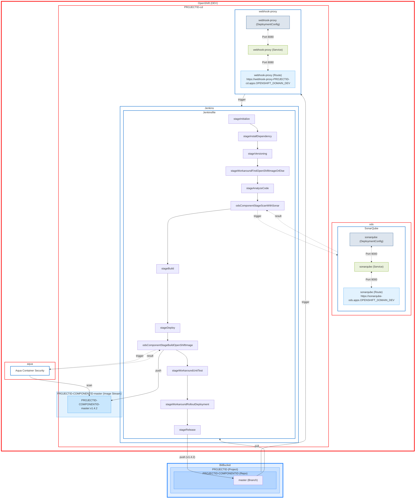
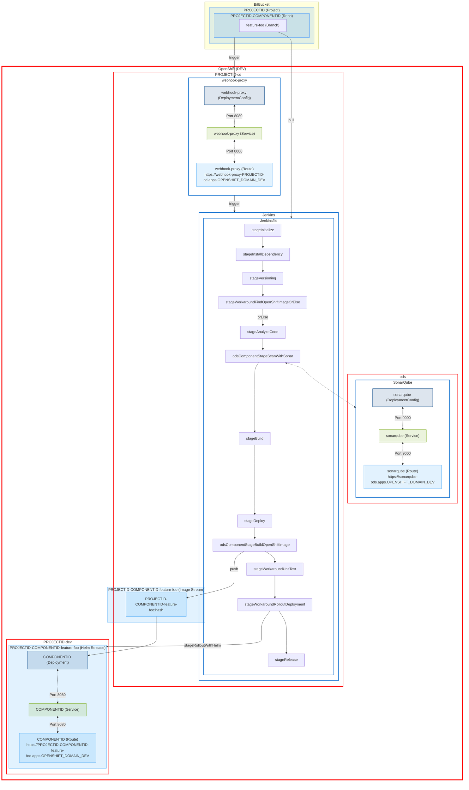
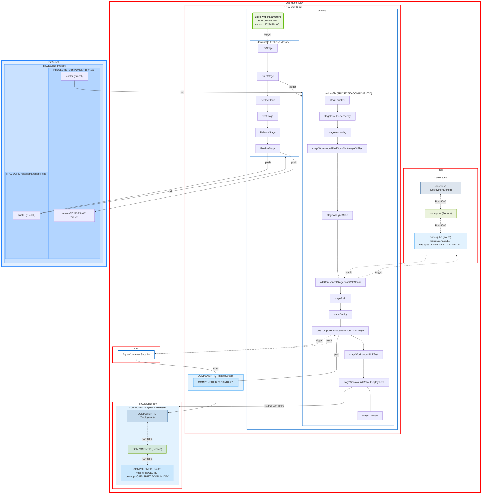
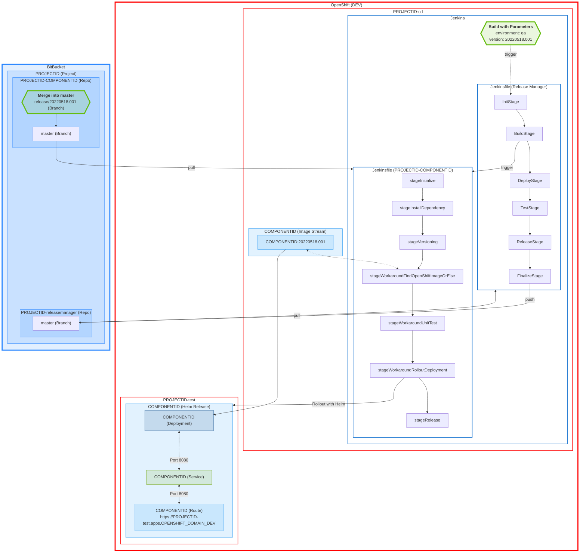
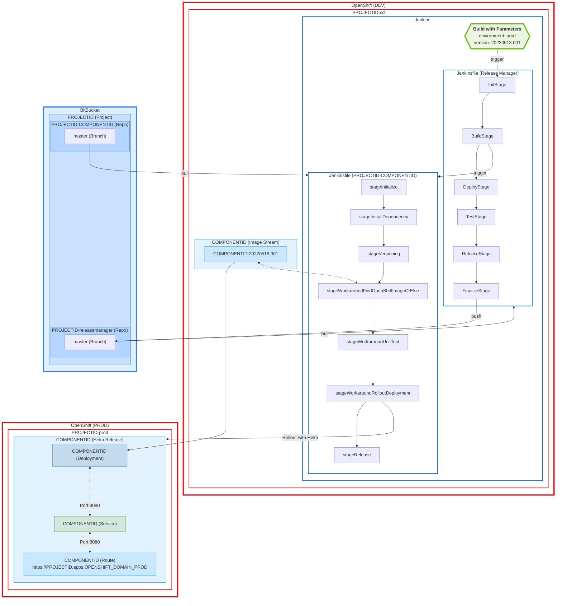

# OpenDevStack - Quickstarter - Frontend Ionic React

> An advanced OpenDevStack Frontend Quickstarter to build mobile and desktop apps with the ionic framework and react.


## Features

- Ionic/React with Typescript for building cross-platform native and web app
- Single-Sign-On (SSO) for user authentication and authorization with Azure Active Directory
- OpenDevStack (ODS) CI/CD configuration out of the box with the basic setup for Docker (incl. injecting Runtime Variables), Jenkins (incl. feature environments, release-manager rollout) and OpenShift (managed with Helm)
  - Ionic Appflow (coming soon)
- Setup for ESlint, Stylelint, Prettier, commitlint, Husky (git hooks) and semantic versioning for a better developer experience

---

<!-- Feel free to delete the section 'Provision Quickstarter' after you successfully provisioned the quickstarter -->

## Provision Quickstarter

### Prerequisites

- A `ODS@4.x` project with the example project id: `foo`.
- In an OpenShift 4 cluster used as `DEV` instance, the following projects:
  - `foo-cd`
  - `foo-dev`
  - `foo-test`
- In an OpenShift 4 cluster used as `PROD` instance, the following projects:

  - `foo-prod`

- Having `helm` and `oc` cli installed and configured.

  ```sh
  # Check helm version
  helm version

  # Check oc version
  oc version
  ```

- A Jenkins agent with Node.js and minimum version `16.x`. In case it does not exist yet, it can be easily created with the following commands:

  ```sh
  # Login
  oc login --server=https://api.OPENSHIFT_DOMAIN_DEV:6443 --token=123...456

  # Switch project
  oc project foo-cd

  # Provision jenkins-agent-nodejs-16
  oc process -f https://raw.githubusercontent.com/SimonGolms/ods-jenkins-agent-nodejs/main/jenkins-agent-nodejs-16-template.yaml | oc create -f -
  ```

  For more information about the Jenkins agent, see: <https://github.com/SimonGolms/ods-jenkins-agent-nodejs>

### Setup Quickstarter

1. Get Source Code

   ```sh
   # Clone Repository
   git clone https://github.com/SimonGolms/ods-quickstarter-fe-ionic-react.git
   cd ods-quickstarter-fe-ionic-react

   # OR download from GitHub
   curl --location --remote-name https://github.com/SimonGolms/ods-quickstarter-fe-ionic-react/archive/refs/heads/main.tar.gz && \
   tar -xvzf main.tar.gz && \
   rm main.tar.gz
   cd ods-quickstarter-fe-ionic-react-main
   ```

2. Set your Project Id (e.g. `foo`) for the Quickstarter

   ```sh
   # Search all the files in the current folder’s subdirectories and replace with the given string. This will also include any hidden files.
   # IMPORTANT: Keep your project id in lowercase.
   find . -type f -exec sed --expression 's/PROJECTID/foo/g' --in-place {} +
   ```

3. Set your Component Id (e.g. `app`) for the Quickstarter

   ```sh
   # Search all the files in the current folder’s subdirectories and replace with the given string. This will also include any hidden files.
   # IMPORTANT: Keep your component id in lowercase.
   find . -type f -exec sed --expression 's/COMPONENTID/app/g' --in-place {} +
   ```

4. Set your OpenShift domain url

   ```sh
   find . -type f -exec sed --expression 's/OPENSHIFT_DOMAIN_DEV/dev.ocp.company.com/g' --in-place {} +
   find . -type f -exec sed --expression 's/OPENSHIFT_DOMAIN_PROD/prod.ocp.company.com/g' --in-place {} +
   ```

5. Set your Bitbucket domain url

   ```sh
   find . -type f -exec sed --expression 's/BITBUCKET_DOMAIN/bitbucket.company.com/g' --in-place {} +
   ```

6. Remove template resources

   ```sh
   rm -rf .git .github CHANGELOG.md
   ```

### Setup Bitbucket Code Repository

1. Create BitBucket Repository

   - Replace `USER@COMPANY.COM` with an authorized (administrative) user with access to the Bitbucket project

   ```sh
   # For security reasons (e.g. terminal history) --user 'USERNAME:PASSWORD' should be avoided.
   # Instead, a prompt will show up for the password if --user 'USERNAME' is used!
   curl --data '{"defaultBranch":"master","description":"📱 Repo of the app from PROJECTID build with ionic and react","name":"PROJECTID-COMPONENTID"}' \
     --header "Content-Type: application/json" \
     --request POST \
     --url https://BITBUCKET_DOMAIN/rest/api/1.0/projects/PROJECTID/repos/ \
     --user 'USER@COMPANY.COM'
   ```

2. Get trigger secret from the webhook proxy

   ```sh
   # Login to OpenShift dev instance
   oc login --server=https://api.OPENSHIFT_DOMAIN_DEV:6443 --token=123...456

   # Get trigger secret 'webhook-proxy' in plaintext
   oc get secret webhook-proxy --namespace PROJECTID-cd --output jsonpath='{.data.trigger-secret}' | base64 -d | xargs
   ```

3. Create Webhook

   - Replace `TRIGGER_SECRET` with the obtained trigger secret from step 1.
   - Replace `USER@COMPANY.COM` with an authorized (administrative) user with access to the Bitbucket project

   ```sh
   # For security reasons (e.g. terminal history) --user 'USERNAME:PASSWORD' should be avoided.
   # Instead, a prompt will show up for the password if --user 'USERNAME' is used!
   curl --data '{"active":true,"configuration":{},"events":["pr:merged","repo:refs_changed","pr:declined","pr:deleted"],"name":"Jenkins","url":"https://webhook-proxy-PROJECTID-cd.apps.OPENSHIFT_DOMAIN_DEV?trigger_secret=TRIGGER_SECRET"}' \
     --header "Content-Type: application/json" \
     --request POST \
     --url https://BITBUCKET_DOMAIN/rest/api/1.0/projects/PROJECTID/repos/PROJECTID-COMPONENTID/webhooks \
     --user 'USER@COMPANY.COM'
   ```

4. Publish to Bitbucket Code Repository

   ```sh
   git init --initial-branch=master
   git add --all
   git commit -m "chore: initial version"
   git remote add origin https://BITBUCKET_DOMAIN/scm/PROJECTID/PROJECTID-COMPONENTID.git
   # Before you push your first commit, make sure that no credentials are in the README as a result of the previous steps.
   # You might also delete unnecessary content in this context.
   git push -u origin HEAD:master
   ```

---

## Technology Stack

### Programming Language

[](https://www.typescriptlang.org/)
[](https://developer.mozilla.org/en-US/docs/Web/JavaScript)
[](https://developer.mozilla.org/en-US/docs/Web/HTML)
[](https://developer.mozilla.org/en-US/docs/Web/CSS)
[](https://www.npmjs.com/)
[](https://nodejs.org/)
[](https://daringfireball.net/projects/markdown/)

### Frameworks and libraries

[](https://ionicframework.com/)
[](https://reactjs.org/)
[](https://reactjs.org/)
[](https://redux-toolkit.js.org/)
[](https://redux-toolkit.js.org/rtk-query/overview)
[](https://github.com/AzureAD/microsoft-authentication-library-for-js/tree/dev/lib/msal-react)
[](https://github.com/AzureAD/microsoft-authentication-library-for-js/tree/dev/lib/msal-react)

**Testing**:

[](https://testing-library.com/docs/react-testing-library/intro)
[](https://jestjs.io/docs/getting-started)

**Tracking**:

N/A

**Linter**:

[](https://eslint.org/)
[](https://stylelint.io/)
[](https://prettier.io/)
[](https://commitlint.js.org/)

**Compiler**:

[-20232a.svg?style=for-the-badge&logo=react&logoColor=61DAFB>)](https://create-react-app.dev/)

### CI/CD

[](https://www.opendevstack.org/)
[](https://nginx.org/)
[](https://www.opendevstack.org/)
[](https://semantic-release.gitbook.io/semantic-release/)
[](https://typicode.github.io/husky/#/)

### Hosting

[](https://docs.openshift.com/container-platform/4.10/welcome/index.html)
[](https://docs.docker.com/)
[](https://nginx.org/)

### Dev Environment

[](https://docs.microsoft.com/en-us/windows/wsl/)

**IDEs/Editors**:

[](https://code.visualstudio.com/)

### Version Control

[](https://git-scm.com/doc)
[](https://bitbucket.org/)

### Social

[](https://www.microsoft.com/en-us/microsoft-teams/)

---

## Prerequisites

1. **Azure App Registration**

   Make sure you have an existing Azure App registry that has a single-page application (SPA) redirect to `http://localhost/`.

   Ideally you have one Azure App registry per environment (`dev`/`test`/`prod`) with at least the following SPA redirects:

   - Dev: `http://localhost/`, `https://PROJECTID-COMPONENTID-dev.apps.OPENSHIFT_DOMAIN_DEV`
   - Test: `http://localhost/`, `https://PROJECTID-COMPONENTID-test.apps.OPENSHIFT_DOMAIN_DEV`
   - Prod: `http://localhost/`, `https://PROJECTID-COMPONENTID.apps.OPENSHIFT_DOMAIN_PROD`

   Update the following entries with the `Application (client) ID` and `Directory (tenant) ID` from the corresponding app registry environment

   1. [`.env`](./.env)

      ```diff
      # Azure - SSO
      - REACT_APP_AZURE_ACTIVE_DIRECTORY_CLIENT_ID=""
      + REACT_APP_AZURE_ACTIVE_DIRECTORY_CLIENT_ID="123...789"
      - REACT_APP_AZURE_ACTIVE_DIRECTORY_TENANT_ID=""
      + REACT_APP_AZURE_ACTIVE_DIRECTORY_TENANT_ID="123...789"
      ```

   2. [`./chart/values.dev.yaml`](./chart/values.dev.yaml)

      _Please make sure that you use the correct client id and tenant id from your app registration for the `dev` environment._

      ```diff
      - azureActiveDirectoryClientId: "11111111-2222-3333-4444-555555555555"
      + azureActiveDirectoryClientId: "123...-dev-...789"
      - azureActiveDirectoryTenantId: "aaaaaaaa-bbbb-cccc-dddd-eeeeeeeeeeee"
      + azureActiveDirectoryTenantId: "abc...-dev-...xyz"
      ```

   3. [`./chart/values.test.yaml`](./chart/values.test.yaml)

      _Please make sure that you use the correct client id and tenant id from your app registration for the `test` environment._

      ```diff
      - azureActiveDirectoryClientId: "11111111-2222-3333-4444-555555555555"
      + azureActiveDirectoryClientId: "123...-test-...789"
      - azureActiveDirectoryTenantId: "aaaaaaaa-bbbb-cccc-dddd-eeeeeeeeeeee"
      + azureActiveDirectoryTenantId: "abc...-test-...xyz"
      ```

   4. [`./chart/values.prod.yaml`](./chart/values.prod.yaml)

      _Please make sure that you use the correct client id and tenant id from your app registration for the `prod` environment._

      ```diff
      - azureActiveDirectoryClientId: "11111111-2222-3333-4444-555555555555"
      + azureActiveDirectoryClientId: "123...-prod-...789"
      - azureActiveDirectoryTenantId: "aaaaaaaa-bbbb-cccc-dddd-eeeeeeeeeeee"
      + azureActiveDirectoryTenantId: "abc...-prod-...xyz"
      ```

   More information: <https://docs.microsoft.com/en-us/azure/active-directory/develop/scenario-spa-app-registration>

## Local Development

### Requirements

- Node.js v16+
- NPM v8+

#### Using [`NVM`](https://github.com/nvm-sh/nvm)

```sh
# Install latest LTS Version (v16+) with the latest npm version (v8+)
nvm install --lts --latest-npm
```

### Set Environment Variables

See `.env.template` to create appropriate `.env` file. Ask your colleagues which values are currently necessary!

### Install Dependencies

```sh
npm install
```

### Start Development Server

```sh
npm run start
```

Starts the development server and makes your application accessible at `localhost:8100`. Changes in the application code will be hot-reloaded.

### Create Production Build (Web)

```sh
npm run build
```

The app is built for optimal performance: assets are minified and served gzipped.

### Run tests

```sh
npm run test
```

### Docker

#### Create Docker Image

```sh
npm run build
mv build docker
docker build -t PROJECTID-COMPONENTID -f docker/Dockerfile docker
```

In case the command `RUN apk update && apk upgrade` cannot be executed (e.g. working behind a proxy), uncomment it for the moment.

#### Start Docker Image

```sh
docker run -p 8080:8080 --env-file .env PROJECTID-COMPONENTID
```

Starts the [nginx](https://nginx.org) server and makes your application accessible at `localhost:8080`.

## Continuous Integration/Continuous Delivery (CI/CD)

This CI/CD setup has been developed for the 'trunk-based development' approach.

> _[...] Trunk-based development is a version control management practice where developers merge small, frequent updates to a core “trunk” or main branch. [...] Trunk-based development is far more simplified since it focuses on the main branch as the source of fixes and releases. In trunk-based development the main branch is assumed to always be stable, without issues, and ready to deploy [...]._ - <https://www.atlassian.com/continuous-delivery/continuous-integration/trunk-based-development>

### Master Branch

The `master` branch is your only real **source-of-true** 📜 and should always reflect the state as found in all three environments.

It is recommended not to merge any changes into the `master`-branch before a new release is triggered. Otherwise there is the risk of not being able to perform a hotfix immediately. The only solution remains a corresponding Git Strategy to restore the old state, import the necessary hotfix changes, release and then add the reset changes again.

With each commit, the source code in the master branch is checked for its releasability and tagged at the end with a new semantic version based on the git commit history.



### Feature Environments

With each new `feature/*` branch created, a new environment is created in the OpenShift Project `PROJECTID-cd`.
Different stages are processed in the Jenkinsfile and finally rolled out and managed via Helm.

Please be aware that a new route (e.g. <https://PROJECTID-COMPONENTID-feature-foo.apps.OPENSHIFT_DOMAIN_DEV>) is created for each new feature environment. If this is required for the SSO login, it must be specified as a new valid redirect URL in the app registration.



### Release Manager

#### Release to `dev` environment



#### Release to `test` environment



#### Release to `prod` environment



## Housekeeping

💡 From time to time, obsolete resources should be cleaned up. It would be best to have this automated at a later time.

### Git Branches

```sh
git checkout master

# Cleaning outdated branches
git fetch --prune

# Delete all local branches except current branch (e.g. master)
git branch | grep --invert-match '^*' | xargs git branch -D

# Delete all remote branches except master (may take some time)
# Skip git hooks with '--no-verify'
git branch -r | grep 'origin' | grep --invert-match 'master$' | grep --invert-match HEAD | cut -d/ -f2- | while read line; do git push --no-verify origin :heads/$line; done;
```

### Git Tags

```sh
# Delete all local tags that do NOT match a pattern of a semantic version
git tag -l | grep --invert-match '^v[[:digit:]].[[:digit:]].[[:digit:]]' | xargs git tag -d

# Delete all remote tags that do NOT match a pattern of a semantic version (e.g. ods-generated-v20220518.001)
# Skip git hooks with '--no-verify'
git ls-remote --tags origin | cut -d/ -f3- | grep --invert-match '^v[[:digit:]].[[:digit:]].[[:digit:]]' | grep -v '}$'| xargs git push --delete --no-verify origin
```

### OpenShift

#### Feature Environments

With the approach of making each feature available as a new deployed environment for testing before it is merged into the master branch, a number of environments are created in OpenShift over time. The easiest way to delete these is to use the following command:

```sh
# Login
oc login --server=https://api.OPENSHIFT_DOMAIN_DEV:6443 --token=123...456

# Switch to Project
oc project PROJECTID-dev

# Delete/Uninstall all feature charts
helm list | grep -e 'COMPONENTID' | cut -f1 | xargs helm uninstall

# Delete all other feature resources
oc get all --output jsonpath='{range .items[*]}{"oc delete "}{.kind}{" "}{.metadata.name}{" "}{"\n"}{end}' | grep -- "COMPONENTID-feature-" | while read -r line; do eval $line; done
```

#### Jenkins Pipelines

**Feature Pipelines**: Since OpenShift 4, Jenkins pipelines are treated as `BuildConfig`. Unfortunately, with `ODS@4.x` in the Jenkins stage [`odsComponentStageBuildOpenShiftImage`](https://www.opendevstack.org/ods-documentation/opendevstack/4.x/jenkins-shared-library/component-pipeline.html#_odscomponentstagebuildopenshiftimage), all builds are also created as a `BuildConfig` in the `cd` project without any further information filled labels. A distinction is not obvious at first view, but can be figured out via the configuration parameter `.spec.strategy.type` (`JenkinsPipeline` vs `Docker`).

**Release Pipelines**: Can be deleted without any problems, since they do not create any further resources, instead they are directly cancelled due to `[skip ci]` in the commit message.

**ODS Quickstarter**: Can be deleted after successful creation without any problems, as there is no further need for them and they only take up resources unnecessarily.

```sh
# Login
oc login --server=https://api.OPENSHIFT_DOMAIN_DEV:6443 --token=123...456

# Switch Project
oc project PROJECTID-cd

# Delete all feature pipelines (may take some time)
oc get bc --output jsonpath='{range .items[*]}{.metadata.name}{"\t"}{.spec.strategy.type}{"\n"}{end}' | grep -e "JenkinsPipeline" | cut -f1 | grep -e "COMPONENTID-feature-" | while read -r line; do oc delete bc $line && sleep 10s; done

# Delete all release pipelines (may take some time)
oc get bc --output custom-columns=NAME:.metadata.name | grep -e "COMPONENTID-release-" | while read -r line; do oc delete bc $line && sleep 10s; done

# Delete all ods quickstarter pipelines (may take some time)
oc get bc --output custom-columns=NAME:.metadata.name | grep -e "ods-qs-" | while read -r line; do oc delete bc $line && sleep 10s; done
```

## Roadmap

- [ ] Implement Android
- [ ] Implement iOS
- [ ] Implement Ionic Appflow
- [ ] Improve Documentation
- [ ] Improve Testing

## Author

**Simon Golms**

- Digital Card: `npx simongolms`
- Github: [@SimonGolms](https://github.com/SimonGolms)
- Website: [gol.ms](https://gol.ms)

## Contributing

Contributions, issues and feature requests are welcome!

## Show your support

Give a ⭐️ if this project helped you!

## License

Copyright © 2022 [Simon Golms](https://github.com/SimonGolms).<br />
This project is [Apache-2.0](https://github.com/SimonGolms/ods-quickstarter-fe-ionic-react/blob/master/LICENSE) licensed.

## Further Resources

- <https://ionicframework.com>
- <https://reactjs.org>
- <https://www.opendevstack.org/>
- <https://helm.sh/>
- <https://docs.atlassian.com/bitbucket-server/rest/7.6.12/bitbucket-rest.html>
