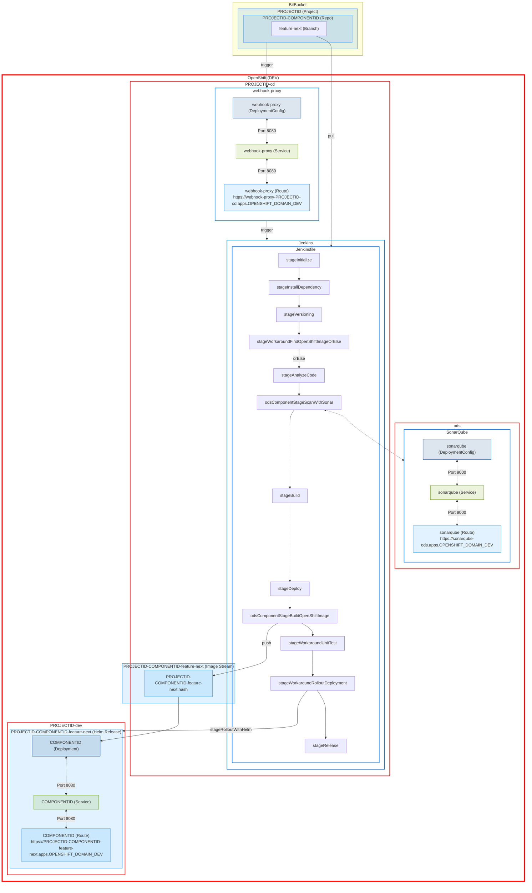

# OpenDevStack - Quickstarter - Frontend Ionic React Vite Playwright

> An advanced OpenDevStack Frontend Quickstarter to build mobile and desktop apps with the ionic framework, react, vite and playwright.


[](https://github.com/simongolms/ods-quickstarter-fe-ionic-react/blob/master/LICENSE)
[](https://github.com/simongolms/ods-quickstarter-fe-ionic-react/graphs/commit-activity)
[](https://conventionalcommits.org)


## Features

- Ionic/React with Typescript for building cross-platform native and web app
- Single-Sign-On (SSO) for user authentication and authorization with Azure Active Directory
- OpenDevStack (ODS) CI/CD configuration out of the box with the basic setup for Docker (incl. injecting Runtime Variables), Jenkins (incl. feature environments, release-manager rollout) and OpenShift (managed with Helm)
  - Ionic Appflow (coming soon)
- Setup for Vite, Playwright, ESlint, Stylelint, Prettier, commitlint, Husky (git hooks) and semantic versioning for a better developer experience

---

<!-- Feel free to delete the section 'Provision Quickstarter' after you successfully provisioned the quickstarter -->

## Provision Quickstarter

For an official ODS Quickstarter, the provisioning app takes care of the provisioning in combination with the Jenkinsfile in the associated Quickstarter template.
However, since this is an extended Quickstarter, which is developed independently and decoupled from ODS, the necessary steps of the provisioning app and Jenkins itself must be performed, which are covered in this section.

### Prerequisites

To provision this Quickstarter, you need a deployed ODS project with the corresponding `*-cd`, `*-dev` and `*-test` projects in the OpenShift 4 dev cluster, the `*-prod` project in the OpenShift 4 prod cluster and the associated Bitbucket project.

### Setup Quickstarter

#### 1. Get Source Code

- Option 1 (recommended): Clone the repository

  ```sh
  git clone https://github.com/SimonGolms/ods-quickstarter-fe-ionic-react.git
  cd ods-quickstarter-fe-ionic-react
  ```

- Option 2: Download the repository

  ```sh
  curl --location --remote-name https://github.com/SimonGolms/ods-quickstarter-fe-ionic-react/archive/refs/heads/main.tar.gz && \
  tar -xvzf main.tar.gz && \
  rm main.tar.gz
  cd ods-quickstarter-fe-ionic-react-main
  ```

#### 2. Set Project Id

To make the Quickstarter available in your project, the corresponding project id is required. With the following command all files are checked. The placeholder `PROJECTID` is searched and replaced by the actual project id.

Replace `YOUR_PROJECT_ID` with your project id, e.g. `foo`

```sh
# IMPORTANT: Keep your project id in lowercase.
find . -type f -exec sed --expression 's/PROJECTID/YOUR_PROJECT_ID/g' --in-place {} +
```

🛑 **IMPORTANT:** This and the other commands also replace the placeholders in the other sections of the documentation. It is therefore recommended to continue with the README in the downloaded source code. Otherwise, please be aware that you have to replace the placeholder `PROJECTID` with your project id for each further command.

#### 3. Set Component Id

Replace `YOUR_COMPONENT_ID` with your component id, e.g. `app`, `frontend`, etc.

```sh
# IMPORTANT: Keep your component id in lowercase.
find . -type f -exec sed --expression 's/COMPONENTID/YOUR_COMPONENT_ID/g' --in-place {} +
```

#### 4. Set OpenShift dev domain URLs

Replace `YOUR_OPENSHIFT_DOMAIN_DEV` with your OpenShift 4 Dev Cluster Domain, e.g. `dev.ocp.company.com`

<details><summary>How do I find out the <code>YOUR_OPENSHIFT_DOMAIN_DEV</code> value?</summary>

Go to your `*-cd` project of your OpenShift 4 Dev Cluster in the browser and look at the URL properly. Extract the `YOUR_OPENSHIFT_DOMAIN_DEV` as follows:

```txt
https://console-openshift-console.apps.dev.ocp.company.com/topology/ns/PROJECTID-cd ◄── Your url

https://console-openshift-console.apps.   dev.ocp.company.com   /topology/ns/PROJECTID-cd
                  ▲                                 ▲                     ▲
                  │                                 │                     └─── Pathname
                  │                                 └── YOUR_OPENSHIFT_DOMAIN_DEV
                  └─ Application Sub Domain
```

</details>

```sh
find . -type f -exec sed --expression 's/OPENSHIFT_DOMAIN_DEV/YOUR_OPENSHIFT_DOMAIN_DEV/g' --in-place {} +
```

#### 5. Set OpenShift prod domain URLs

Replace `YOUR_OPENSHIFT_DOMAIN_PROD` with your OpenShift 4 Dev Cluster Domain, e.g. `prod.ocp.company.com`

<details><summary>How do I find out the <code>YOUR_OPENSHIFT_DOMAIN_PROD</code> value?</summary>

Go to your `*-prod` project of your OpenShift 4 Dev Cluster in the browser and look at the URL properly. Extract the `YOUR_OPENSHIFT_DOMAIN_PROD` as follows:

```txt
https://console-openshift-console.apps.dev.ocp.company.com/topology/ns/PROJECTID-cd ◄── Your url

https://console-openshift-console.apps.   dev.ocp.company.com   /topology/ns/PROJECTID-cd
                  ▲                                 ▲                     ▲
                  │                                 │                     └─── Pathname
                  │                                 └── YOUR_OPENSHIFT_DOMAIN_PROD
                  └─ Application Sub Domain
```

</details>

```sh
find . -type f -exec sed --expression 's/OPENSHIFT_DOMAIN_PROD/YOUR_OPENSHIFT_DOMAIN_PROD/g' --in-place {} +
```

#### 6. Set BitBucket domain URL

Replace `YOUR_BITBUCKET_DOMAIN` with your BitBucket Domain, e.g. `bitbucket.company.com`

<details><summary>How do I find out the <code>YOUR_BITBUCKET_DOMAIN</code> value?</summary>

Go to your BitBucket project in the browser and look at the URL properly. Extract the `YOUR_BITBUCKET_DOMAIN` as follows:

```txt
https://bitbucket.company.com/projects/PROJECTID ◄── Your url

https://   bitbucket.company.com   /projects/PROJECTID
  ▲                ▲                     ▲
  │                │                     └─── Pathname
  │                └── YOUR_BITBUCKET_DOMAIN
  └─ Protocol
```

</details>

```sh
find . -type f -exec sed --expression 's/BITBUCKET_DOMAIN/YOUR_BITBUCKET_DOMAIN/g' --in-place {} +
```

#### 7. Remove template resources

```sh
rm -rf .git .github CHANGELOG.md
```

#### 8. Install `helm` cli

[Helm](https://helm.sh/) is a package manager for Kubernetes that configures and deploys applications and services on a Kubernetes/OpenShift cluster. Think of it like `apt`/`yum`/`homebrew` for Kubernetes. It uses Helm charts to simplify the development and deployment process.

`helm` will be used later in the [`pre-commit`](./.husky/pre-commit) git hook for linting the application [Helm charts](./chart/).

```sh
# Install helm cli
curl https://raw.githubusercontent.com/helm/helm/main/scripts/get-helm-3 | bash

# Verify successfully installed helm version
helm version
```

More Information: <https://helm.sh/docs/intro/install/>

#### 9. Install `oc` cli

With the OpenShift command-line interface (CLI), the `oc` command, you can create applications and manage OpenShift Container Platform projects from a terminal.

`oc` will be used by helm and for further configuration and housekeeping tasks.

To be compatible with the latest OpenShift Container Platform (OCP) version, the binary is downloaded and installed from the associated OpenShift Container Platform.

```sh
# Install oc cli
curl -O https://downloads-openshift-console.apps.OPENSHIFT_DOMAIN_DEV/amd64/linux/oc.tar && \
tar -xvf oc.tar && rm oc.tar && \
sudo mv oc /usr/local/bin/

# Verify successfully installed oc version
oc version
```

More Information: <https://docs.openshift.com/container-platform/4.9/cli_reference/openshift_cli/getting-started-cli.html>

#### 10. Setup Bitbucket Code Repository

1. Create BitBucket Repository

   - Replace `USER@COMPANY.COM` with an authorized (administrative) user with access to the Bitbucket project

   ```sh
   # For security reasons (e.g. terminal history) --user 'USERNAME:PASSWORD' should be avoided.
   # Instead, a prompt will show up for the password if --user 'USERNAME' is used!
   curl --data '{"defaultBranch":"master","description":"📱 Repo of COMPONENTID from PROJECTID that is build with ionic and react","name":"PROJECTID-COMPONENTID"}' \
     --header "Content-Type: application/json" \
     --request POST \
     --url https://BITBUCKET_DOMAIN/rest/api/1.0/projects/PROJECTID/repos/ \
     --user USER@COMPANY.COM
   ```

2. Get trigger secret from the webhook proxy

   ```sh
   # Login to OpenShift dev instance
   oc login --server=https://api.OPENSHIFT_DOMAIN_DEV:6443 --token=123...456

   # Get trigger secret 'webhook-proxy' in plaintext
   oc get secret webhook-proxy --namespace PROJECTID-cd --output jsonpath='{.data.trigger-secret}' | base64 -d | xargs
   ```

3. Create Webhook

   - Replace `TRIGGER_SECRET` with the obtained trigger secret from previous step.
   - Replace `USER@COMPANY.COM` with an authorized (administrative) user with access to the Bitbucket project

   ```sh
   # For security reasons (e.g. terminal history) --user 'USERNAME:PASSWORD' should be avoided.
   # Instead, a prompt will show up for the password if --user 'USERNAME' is used!
   curl --data '{"active":true,"configuration":{},"events":["pr:merged","repo:refs_changed","pr:declined","pr:deleted"],"name":"Jenkins","url":"https://webhook-proxy-PROJECTID-cd.apps.OPENSHIFT_DOMAIN_DEV?trigger_secret=TRIGGER_SECRET"}' \
     --header "Content-Type: application/json" \
     --request POST \
     --url https://BITBUCKET_DOMAIN/rest/api/1.0/projects/PROJECTID/repos/PROJECTID-COMPONENTID/webhooks \
     --user USER@COMPANY.COM
   ```

4. Publish to Bitbucket Code Repository

   ```sh
   # Requires git v2.31.1
   git init --initial-branch=master
   git add --all
   git commit -m "chore: initial version"
   git remote add origin https://BITBUCKET_DOMAIN/scm/PROJECTID/PROJECTID-COMPONENTID.git
   # Before you push your first commit, make sure that no credentials are in the README as a result of the previous steps.
   # You might also delete unnecessary content in this context, like the 'Provision Quickstarter' section of this README.
   git push -u origin HEAD:master
   ```

### Verify successfully provision

If the provisioning was successful, the previous push of the first commit should have triggered the first build process in Jenkins in the meantime, which can be viewed under the following link: <https://jenkins-PROJECTID-cd.apps.OPENSHIFT_DOMAIN_DEV/job/PROJECTID-cd/job/PROJECTID-cd-COMPONENTID-master/>

#### Feature Environment

A new feature environment is created by the associated git branch name, e.g. `feature/next`.

```sh
# Creates and switch to new branch from the current branch
git checkout -b feature/next

# Add empty commit in case the previous commit includes '[skip ci]'
git commit -m "chore: create feature-next environment" --allow-empty

# Push the new branch to the remote repository
git push -u origin feature/next
```

A new Jenkins build should have been created and can be followed under the following link: <https://jenkins-PROJECTID-cd.apps.OPENSHIFT_DOMAIN_DEV/job/PROJECTID-cd/job/PROJECTID-cd-COMPONENTID-feature-next/>

Assuming the Jenkins build has been successfully completed, the application should have been created in the OpenShift 4 project [`PROJECTID-dev`](https://console-openshift-console.apps.OPENSHIFT_DOMAIN_DEV/topology/ns/PROJECTID-dev) as a new [`HelmRelease`](https://console-openshift-console.apps.OPENSHIFT_DOMAIN_DEV/helm-releases/ns/PROJECTID-dev/release/PROJECTID-COMPONENTID-feature-next) resource and should be accessible under the following link: <https://PROJECTID-COMPONENTID-feature-next.apps.OPENSHIFT_DOMAIN_DEV>

#### Release to `dev`, `test` and `prod`

1. Update your `metadata.yml` in your release manager repository

   ```yaml
   # Example metadata.yml
   id: PROJECTID
   name: Project PROJECTID
   description: Description of PROJECTID

   environments:
     prod:
       apiUrl: api.OPENSHIFT_DOMAIN_PROD:6443
       credentialsId: PROJECTID-cd-PROJECTID-prod

   repositories:
     - id: COMPONENTID
       branch: master
       url: https://bitbucket.biscrum.com/scm/PROJECTID/PROJECTID-COMPONENTID.git

   services:
     bitbucket:
       credentials:
         id: PROJECTID-cd-cd-user-with-password
     # jira:
     #   credentials:
     #     id: PROJECTID-cd-cd-user-with-password
     nexus:
       repository:
         name: leva-documentation
   ```

2. Go to the Jenkins build of the release manager and start a new build process in the `dev` environment. Assuming the release has been successfully completed, the application should have been created in the OpenShift 4 project [`PROJECTID-dev`](https://console-openshift-console.apps.OPENSHIFT_DOMAIN_DEV/topology/ns/PROJECTID-dev) as a new [`HelmRelease`](https://console-openshift-console.apps.OPENSHIFT_DOMAIN_DEV/helm-releases/ns/PROJECTID-dev/release/COMPONENTID) resource and should be accessible under the following link: <https://PROJECTID-COMPONENTID-dev.apps.OPENSHIFT_DOMAIN_DEV>

3. Before you can deploy a release into `qa`/`test` environment, you need to merge the release branch into your master branch to pass the checks in the Jenkins shared library stage [`odsOrchestrationPipeline`](https://github.com/opendevstack/ods-jenkins-shared-library/blob/4.x/vars/odsOrchestrationPipeline.groovy), see comment in [`metadata.yml`](./metadata.yml) for more details:

   ```sh
   # Switch to master branch
   git checkout master

   # Merge the remote release branch into master without opening a text editor and accept the auto-generated message
   git merge origin/release/<VERSION> --no-edit

   # Push the changes to the remote repository
   git push
   ```

4. Go to the Jenkins build of the release manager and start a new build process in the `qa`/`test` environment. Assuming the release has been successfully completed, the application should have been created in the OpenShift 4 project [`PROJECTID-test`](https://console-openshift-console.apps.OPENSHIFT_DOMAIN_DEV/topology/ns/PROJECTID-test) as a new [`HelmRelease`](https://console-openshift-console.apps.OPENSHIFT_DOMAIN_DEV/helm-releases/ns/PROJECTID-test/release/COMPONENTID) resource and should be accessible under the following link: <https://PROJECTID-COMPONENTID-test.apps.OPENSHIFT_DOMAIN_DEV>

5. Go to the Jenkins build of the release manager and start a new build process in the `prod` environment. Assuming the release has been successfully completed, the application should have been created in the OpenShift 4 project [`PROJECTID-prod`](https://console-openshift-console.apps.OPENSHIFT_DOMAIN_PROD/topology/ns/PROJECTID-prod) as a new [`HelmRelease`](https://console-openshift-console.apps.OPENSHIFT_DOMAIN_PROD/helm-releases/ns/PROJECTID-prod/release/COMPONENTID) resource and should be accessible under the following link: <https://PROJECTID-COMPONENTID.apps.OPENSHIFT_DOMAIN_DEV>

---

## Technology Stack

### Programming Language

[](https://www.typescriptlang.org/)
[](https://developer.mozilla.org/en-US/docs/Web/JavaScript)
[](https://developer.mozilla.org/en-US/docs/Web/HTML)
[](https://developer.mozilla.org/en-US/docs/Web/CSS)
[](https://www.npmjs.com/)
[](https://nodejs.org/)
[](https://daringfireball.net/projects/markdown/)

### Frameworks and libraries

[](https://ionicframework.com/)
[](https://reactjs.org/)
[](https://reactjs.org/)
[](https://redux-toolkit.js.org/)
[](https://redux-toolkit.js.org/rtk-query/overview)
[](https://github.com/AzureAD/microsoft-authentication-library-for-js/tree/dev/lib/msal-react)
[](https://github.com/AzureAD/microsoft-authentication-library-for-js/tree/dev/lib/msal-react)

**Testing**:

[](https://playwright.dev/)

**Tracking**:

N/A

**Linter**:

[](https://eslint.org/)
[](https://stylelint.io/)
[](https://prettier.io/)
[](https://commitlint.js.org/)

**Compiler**:

[](https://vitejs.dev/)

### CI/CD

[](https://www.opendevstack.org/)
[](https://nginx.org/)
[](https://www.opendevstack.org/)
[](https://semantic-release.gitbook.io/semantic-release/)
[](https://typicode.github.io/husky/#/)

### Hosting

[](https://docs.openshift.com/container-platform/4.10/welcome/index.html)
[](https://docs.docker.com/)
[](https://nginx.org/)

### Dev Environment

[](https://docs.microsoft.com/en-us/windows/wsl/)

**IDEs/Editors**:

[](https://code.visualstudio.com/)

### Version Control

[](https://git-scm.com/doc)
[](https://bitbucket.org/)

### Social

[](https://www.microsoft.com/en-us/microsoft-teams/)

---

## Prerequisites

1. **Azure App Registration**

   Make sure you have an existing Azure App registry that has a single-page application (SPA) redirect to `http://localhost/`.

   Ideally you have one Azure App registry per environment (`dev`/`test`/`prod`) with at least the following SPA redirects:

   - Dev: `http://localhost/`, `https://PROJECTID-COMPONENTID-dev.apps.OPENSHIFT_DOMAIN_DEV`
   - Test: `http://localhost/`, `https://PROJECTID-COMPONENTID-test.apps.OPENSHIFT_DOMAIN_DEV`
   - Prod: `http://localhost/`, `https://PROJECTID-COMPONENTID.apps.OPENSHIFT_DOMAIN_PROD`

   Update the following entries with the `Application (client) ID` and `Directory (tenant) ID` from the corresponding app registry environment

   1. [`.env`](./.env)

      ```diff
      # Azure - SSO
      - REACT_APP_AZURE_ACTIVE_DIRECTORY_CLIENT_ID=""
      + REACT_APP_AZURE_ACTIVE_DIRECTORY_CLIENT_ID="123...789"
      - REACT_APP_AZURE_ACTIVE_DIRECTORY_TENANT_ID=""
      + REACT_APP_AZURE_ACTIVE_DIRECTORY_TENANT_ID="123...789"
      ```

   2. [`./chart/values.dev.yaml`](./chart/values.dev.yaml)

      _Please make sure that you use the correct client id and tenant id from your app registration for the `dev` environment._

      ```diff
      - azureActiveDirectoryClientId: "11111111-2222-3333-4444-555555555555"
      + azureActiveDirectoryClientId: "123...-dev-...789"
      - azureActiveDirectoryTenantId: "aaaaaaaa-bbbb-cccc-dddd-eeeeeeeeeeee"
      + azureActiveDirectoryTenantId: "abc...-dev-...xyz"
      ```

   3. [`./chart/values.test.yaml`](./chart/values.test.yaml)

      _Please make sure that you use the correct client id and tenant id from your app registration for the `test` environment._

      ```diff
      - azureActiveDirectoryClientId: "11111111-2222-3333-4444-555555555555"
      + azureActiveDirectoryClientId: "123...-test-...789"
      - azureActiveDirectoryTenantId: "aaaaaaaa-bbbb-cccc-dddd-eeeeeeeeeeee"
      + azureActiveDirectoryTenantId: "abc...-test-...xyz"
      ```

   4. [`./chart/values.prod.yaml`](./chart/values.prod.yaml)

      _Please make sure that you use the correct client id and tenant id from your app registration for the `prod` environment._

      ```diff
      - azureActiveDirectoryClientId: "11111111-2222-3333-4444-555555555555"
      + azureActiveDirectoryClientId: "123...-prod-...789"
      - azureActiveDirectoryTenantId: "aaaaaaaa-bbbb-cccc-dddd-eeeeeeeeeeee"
      + azureActiveDirectoryTenantId: "abc...-prod-...xyz"
      ```

   5. [`./Jenkinsfile`](./Jenkinsfile)

      _Please make sure that you use the correct client id and tenant id from your app registration for the `dev` environment._

      ```diff
      - 'VITE_AZURE_ACTIVE_DIRECTORY_CLIENT_ID=11111111-2222-3333-4444-555555555555',
      + 'VITE_AZURE_ACTIVE_DIRECTORY_CLIENT_ID=123...-dev-...789',
      ...
      - 'VITE_AZURE_ACTIVE_DIRECTORY_TENANT_ID=aaaaaaaa-bbbb-cccc-dddd-eeeeeeeeeeee',
      + 'VITE_AZURE_ACTIVE_DIRECTORY_TENANT_ID=abc...-dev-...xyz',
      ```

   More information: <https://docs.microsoft.com/en-us/azure/active-directory/develop/scenario-spa-app-registration>

## Local Development

### Requirements

- Helm v3+
- Node.js v16+
- NPM v8+
- oc v4.9+

#### Using [`NVM`](https://github.com/nvm-sh/nvm)

```sh
# Install latest LTS Version (v16+) with the latest npm version (v8+)
nvm install --lts --latest-npm
```

### Set Environment Variables

See `.env.template` to create appropriate `.env` file. Ask your colleagues which values are currently necessary!

### Install Dependencies

```sh
npm install
```

### Start Development Server

```sh
npm run start
```

Starts the development server and makes your application accessible at `localhost:8100`. Changes in the application code will be hot-reloaded.

### Create Production Build (Web)

```sh
npm run build
```

The app is built for optimal performance: assets are minified and served gzipped.

### Run tests

```sh
npm run test
```

### Docker

#### Create Docker Image

```sh
npm run build
mv build docker
docker build -t PROJECTID-COMPONENTID -f docker/Dockerfile docker
```

In case the command `RUN apk update && apk upgrade` cannot be executed (e.g. working behind a proxy), uncomment it for the moment.

#### Start Docker Image

```sh
docker run -p 8080:8080 --env-file .env PROJECTID-COMPONENTID
```

Starts the [nginx](https://nginx.org) server and makes your application accessible at `localhost:8080`.

## Continuous Integration/Continuous Delivery (CI/CD)

This CI/CD setup has been developed for the 'trunk-based development' approach.

> _[...] Trunk-based development is a version control management practice where developers merge small, frequent updates to a core “trunk” or main branch. [...] Trunk-based development is far more simplified since it focuses on the main branch as the source of fixes and releases. In trunk-based development the main branch is assumed to always be stable, without issues, and ready to deploy [...]._ - <https://www.atlassian.com/continuous-delivery/continuous-integration/trunk-based-development>

### Master Branch

The `master` branch is your only real **source-of-true** 📜 and should always reflect the state as found in all three environments.

It is recommended not to merge any changes into the `master`-branch before a new release is triggered. Otherwise there is the risk of not being able to perform a hotfix immediately. The only solution remains a corresponding Git Strategy to restore the old state, import the necessary hotfix changes, release and then add the reset changes again.

With each commit, the source code in the master branch is checked for its releasability and tagged at the end with a new semantic version based on the git commit history.


### Feature Environments

With each new `feature/*` branch created, a new environment is created in the OpenShift Project `PROJECTID-cd`.
Different stages are processed in the Jenkinsfile and finally rolled out and managed via Helm.

Please be aware that a new route (e.g. <https://PROJECTID-COMPONENTID-feature-next.apps.OPENSHIFT_DOMAIN_DEV>) is created for each new feature environment. If this is required for the SSO login, it must be specified as a new valid redirect URL in the app registration.



### Release Manager

#### Release to `dev` environment


#### Release to `test` environment


#### Release to `prod` environment


## Housekeeping

💡 From time to time, obsolete resources should be cleaned up. It would be best to have this automated at a later time. However, at the moment, this is not yet possible, because the webhook-proxy captures the `deleted` event and cannot be further customized, see: <https://github.com/opendevstack/ods-core/blob/99d26527df60fbb4d72ba15a8c233e325ff37fe1/jenkins/webhook-proxy/main.go#L541-L556>

### Git Branches

```sh
git checkout master

# Cleaning outdated branches
git fetch --prune

# Delete all local branches except current branch (e.g. master)
git branch | grep --invert-match '^*' | xargs git branch -D

# Delete all remote branches except master (may take some time)
# Skip git hooks with '--no-verify'
git branch -r | grep 'origin' | grep --invert-match 'master$' | grep --invert-match HEAD | cut -d/ -f2- | while read line; do git push --no-verify origin :heads/$line; done;
```

### Git Tags

```sh
# Delete all local tags that do NOT match a pattern of a semantic version (MAJOR.MINOR.PATCH), e.g. ods-generated-v20220518.001, v1.0.0-next.5
git tag -l | grep --invert-match '^v[[:digit:]].[[:digit:]].[[:digit:]]$' | xargs git tag -d

# Delete all remote tags that do NOT match a pattern of a semantic version (MAJOR.MINOR.PATCH), e.g. ods-generated-v20220518.001, v1.0.0-next.5
# Skip git hooks with '--no-verify'
git ls-remote --tags origin | cut -d/ -f3- | grep --invert-match '^v[[:digit:]].[[:digit:]].[[:digit:]]$' | grep -v '}$' | xargs git push --delete --no-verify origin
```

### OpenShift

#### Feature Environments

With the approach of making each feature available as a new deployed environment for testing before it is merged into the master branch, a number of environments are created in OpenShift over time. The easiest way to delete these is to use the following command:

```sh
# Login
oc login --server=https://api.OPENSHIFT_DOMAIN_DEV:6443 --token=123...456

# Switch to Project
oc project PROJECTID-dev

# Delete/Uninstall all feature charts
helm list | grep -e 'COMPONENTID' | cut -f1 | xargs helm uninstall

# Delete all other feature resources
oc get all --output jsonpath='{range .items[*]}{"oc delete "}{.kind}{" "}{.metadata.name}{" "}{"\n"}{end}' | grep -- "COMPONENTID-feature-" | while read -r line; do eval $line; done
```

#### Jenkins Pipelines

**Feature Pipelines**: Since OpenShift 4, Jenkins pipelines are treated as `BuildConfig`. Unfortunately, with `ODS@4.x` in the Jenkins stage [`odsComponentStageBuildOpenShiftImage`](https://www.opendevstack.org/ods-documentation/opendevstack/4.x/jenkins-shared-library/component-pipeline.html#_odscomponentstagebuildopenshiftimage), all builds are also created as a `BuildConfig` in the `cd` project without any further information filled labels. A distinction is not obvious at first view, but can be figured out via the configuration parameter `.spec.strategy.type` (`JenkinsPipeline` vs `Docker`).

**Release Pipelines**: Can be deleted without any problems, since they do not create any further resources, instead they are directly cancelled due to `[skip ci]` in the commit message.

**ODS Quickstarter**: Can be deleted after successful creation without any problems, as there is no further need for them and they only take up resources unnecessarily.

```sh
# Login
oc login --server=https://api.OPENSHIFT_DOMAIN_DEV:6443 --token=123...456

# Switch Project
oc project PROJECTID-cd

# Delete all feature pipelines (may take some time)
oc get bc --output jsonpath='{range .items[*]}{.metadata.name}{"\t"}{.spec.strategy.type}{"\n"}{end}' | grep -e "JenkinsPipeline" | cut -f1 | grep -e "COMPONENTID-feature-" | while read -r line; do oc delete bc $line && sleep 10s; done

# Delete all release pipelines (may take some time)
oc get bc --output custom-columns=NAME:.metadata.name | grep -e "COMPONENTID-release-" | while read -r line; do oc delete bc $line && sleep 10s; done

# Delete all ods quickstarter pipelines (may take some time)
oc get bc --output custom-columns=NAME:.metadata.name | grep -e "ods-qs-" | while read -r line; do oc delete bc $line && sleep 10s; done
```

## Roadmap

- [x] Improve Documentation
- [ ] Implement Android
- [ ] Implement iOS
- [ ] Implement Ionic Appflow
- [x] Improve Testing

## FAQ

### Jenkins

<details><summary>How do I find out which a Jenkins Agent with Node.js are available in my <code>ODS@4.x</code> setup?</summary>

Go to <https://oauth-openshift.apps.OPENSHIFT_DOMAIN_DEV/k8s/ns/ods/build.openshift.io~v1~BuildConfig?name=jenkins-agent-nodejs>

</details>

### Openshift

<details><summary>How to find the <code>oc</code> login token</summary>

1. Go to <https://oauth-openshift.apps.OPENSHIFT_DOMAIN_DEV/oauth/token/display>
2. Click on `Display token` or `Request another token`

</details>

## Known Issues

### Bitbucket

<details><summary>A Pull Request shows a merge conflict on <code>chart/Chart.yaml</code>, <code>chart/values.yaml</code>, <code>CHANGELOG.md</code>, <code>metadata.yml</code>, <code>package-lock.json</code>, <code>package.json</code>, <code>README.md</code></summary>

This happens mainly when e.g. a new `feature` branch has already been created from `master` branch before the Jenkins job has been successfully completed with a release commit.

To avoid resolving all merge conflicts manually, this can already be specified in the `merge` command by the [`--strategy-option=theirs`](https://www.git-scm.com/docs/git-merge#Documentation/git-merge.txt---strategy-optionltoptiongt) option to automatically accept all incoming changes.

**Solution:**

```sh
# Merge the remote master branch into the current one without opening a text editor (accept the auto-generated message) and accept all incoming changes on merge conflicts
git merge origin/master --no-edit --strategy-option=theirs

# (Optional) Add `skip ci` command to the previous merge commit
git commit --amend -m "$(git log --format=%s --max-count=1) [skip ci]"

# Push the changes to the remote repository
git push
```

</details>

### Jenkins

<details><summary>The Jenkins pipeline does not start and shows the following error message:<code>[Failed] Failed to pull image "image-registry.openshift-image-registry.svc:5000/ods/jenkins-agent-nodejs16:4.x" ... [Failed] Error: ImagePullBackOff</code></summary>

It might happen that your `ODS@4.x` setup only provides a Jenkins agent with Node.js `12.x`. However, in order to be able to work with the latest version and to have potential security holes closed, a Jenkins agent with the latest Node.js version is required for the build process in the CI/CD process.

[FAQ: How do I find out which a Jenkins Agent with Node.js are available in my `ODS@4.x` setup?](#faq)

In case it does not exist yet, it can be easily created with the following commands

[FAQ: How to find the `oc` login token](#faq)

**Solution:**

```sh
# Login to OpenShift dev instance
oc login --server=https://api.OPENSHIFT_DOMAIN_DEV:6443 --token=123...456

# Switch project
oc project PROJECTID-cd

# Provision jenkins-agent-nodejs-16
oc process -f https://raw.githubusercontent.com/SimonGolms/ods-jenkins-agent-nodejs/main/jenkins-agent-nodejs-16-template.yaml | oc create -f -
```

For more information about the Jenkins agent, see: <https://github.com/SimonGolms/ods-jenkins-agent-nodejs>

</details>

<details><summary>The Release Manager finishes the release to the <code>qa</code>/<code>test</code> environment with the following yellow message: <code>Finished: UNSTABLE</code></summary>

This state is already set at the beginning by the following message in the Jenkins log: `WARN: app@<GIT-HASH-1> is NOT a descendant of <GIT-HASH-2>, which has previously been promoted to 'Q'. If <GIT-HASH-2> has been promoted to 'P' as well, promotion to 'P' will fail. Proceed with caution.`

Before you can deploy a release into `qa`/`test` environment, you need to merge the release branch into your master branch to pass the checks in the Jenkins shared library stage [`odsOrchestrationPipeline`](https://github.com/opendevstack/ods-jenkins-shared-library/blob/4.x/vars/odsOrchestrationPipeline.groovy), see comment in [`metadata.yml`](./metadata.yml) for more details:

**Solution:**

```sh
# Switch to master branch
git checkout master

# Merge the remote release branch into master without opening a text editor and accept the auto-generated message
git merge origin/release/<VERSION> --no-edit

# Push the changes to the remote repository
git push
```

</details>

## Author

**Simon Golms:**

- Digital Card: `npx simongolms`
- Github: [@SimonGolms](https://github.com/SimonGolms)
- Website: [gol.ms](https://gol.ms)

## Contributing

Contributions, issues and feature requests are welcome!

## Show your support

Give a ⭐️ if this project helped you!

## License

Copyright © 2022 [Simon Golms](https://github.com/SimonGolms).<br />
This project is [Apache-2.0](https://github.com/SimonGolms/ods-quickstarter-fe-ionic-react/blob/master/LICENSE) licensed.

## Further Resources

- <https://docs.atlassian.com/bitbucket-server/rest/7.6.12/bitbucket-rest.html>
- <https://helm.sh/>
- <https://ionicframework.com>
- <https://reactjs.org>
- <https://www.opendevstack.org/>
